# Get Strong

## Purpose

Get Strong is a landing page to encourage people to get strong within the gym. Get Strong provides a set of example exercises in order to help with strength gains. Get strong helps people of all skill levels and gives them basic knowledge. At Get Strong we aim our website to anyone who wants to get into the gym and particularly make strength gains.

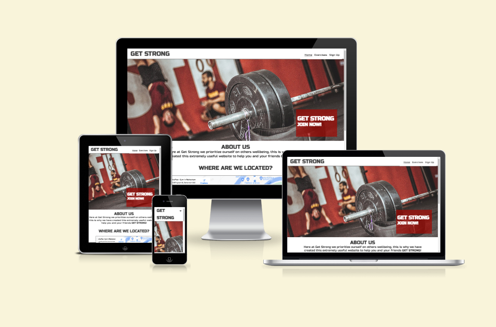

## Planning

### WireFrames

- Below is the wireframes I created to plan the design of the website. By using wireframes it helped me works towards a design and have a more focused end product.

- __About Page__
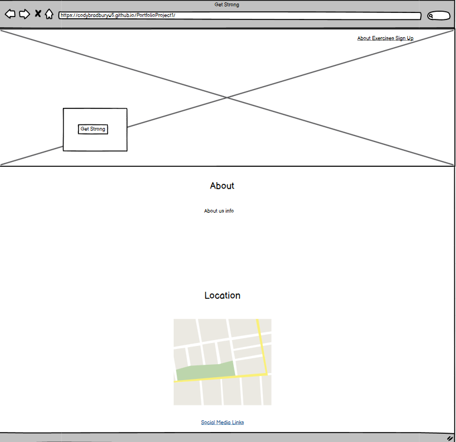

- __Exercises Page__
  
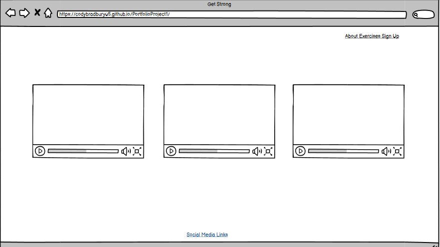

- __Sign Up Page__
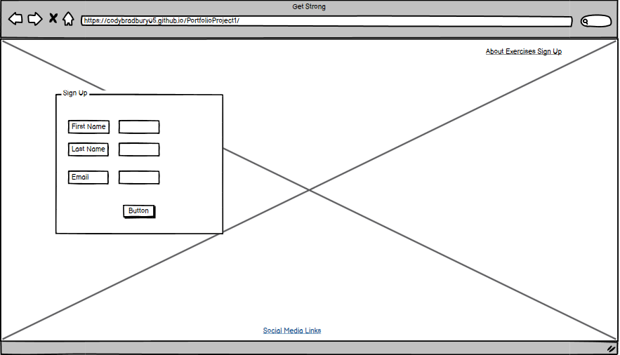

## Features

### Existing Features

- __Navigation Bar__

  - The Navigation Bar is on all 3 pages. This allows users to easily navigate around the pages. The Nav Bar consists of the Home page, Exercises page and the Signup page.
  - The Home page engages the user and acknowledges the user of what the page is about and why they are here. Straight away the users are aware of the purpose of the site and whether or not it is the correct site for them.
  - The Nav bar aids in accessibility within the website without having to use built-in browser features to navigate the site. For example the 'back' or 'forwards' button. The 'Get Strong' heading allows the user to click and head straight back to the home page.
  

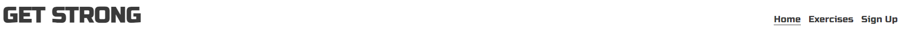

- __The landing page image__

  - The Get Strong landing page image instantly grabs the attention of the user and notifies them of the purpose of the site.
  - The landing page has a big hero image and a smaller text area which consists of the website name and 'Join Now!'

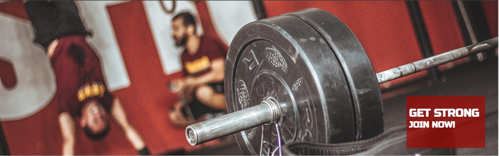

- __Get Strong About Section__

  - The Get Strong About section, lets the user know the purpose of the website.
  - This will entice the user to navigate the page and eventually sign up to Get Strong!

- __Location Section__

  - This section allows the user to see where Get Strong is based and where they can come and help themselves get strong.
  - Get Strong is based out of one of the best gyms in the UK!

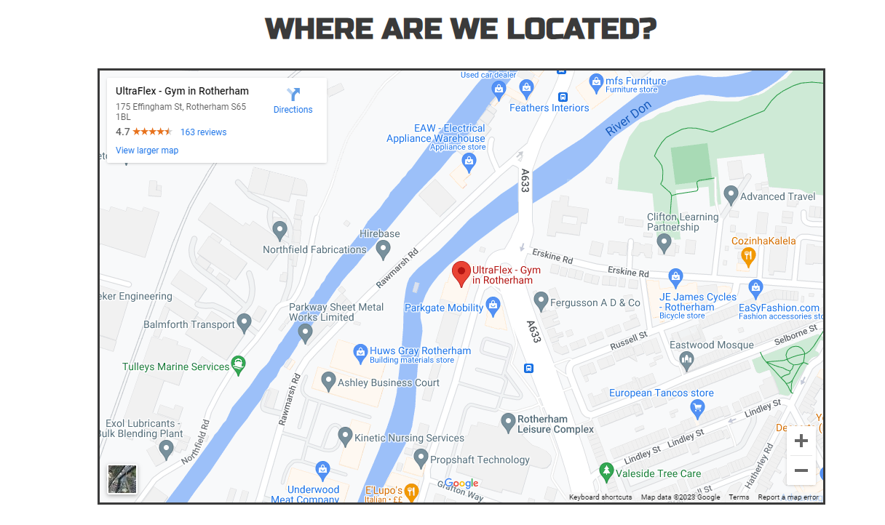

- __The Footer__

  - The footer section includes the 'links' for the Get Strong social media pages. The links open in a new tab to make sure their time on the website is not interrupted.
  - The footer adds value to the user as they can keep up to date with Get Strong through social media.

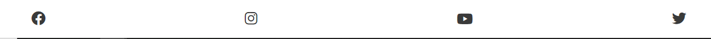

- __Exercises__
- 
  - The exercises section provides the user with example videos of exercises to see ways of getting strong.
  - This provides value to users as they will able to view any potential exercises they may want to try themselves to help get strong.

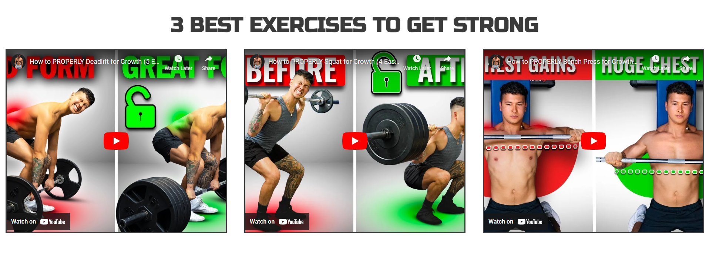

- __The Sign Up Page__
- 
  - This page allows the user to get signed up to Get Strong and start their path to getting stronger. The user will be asked and required to enter their full name and email address to signup.

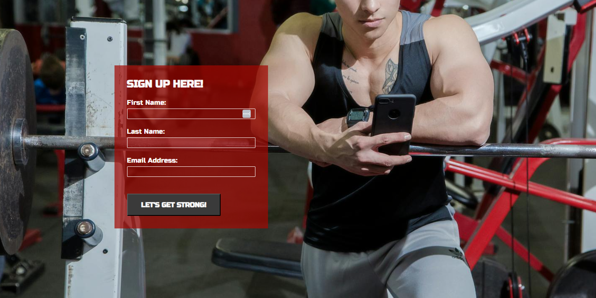

### Features Left to Implement

- In the future, this website has the ability to become a fully implemented gym website that can help meet targets and allow gym members to track their lifts. The potential is limitless.

## Testing

### Cross-browser Testing

- I have checked my website works on multiple browsers, such as Firefox, Edge, Opera and Chrome.

### Responsive Design Testing

- My responsive design works as intended on all the browsers I have tested.
- I have used websites such as <https://ui.dev/amiresponsive?url=https://codybradbury05.github.io/PortfolioProject1/> to also check whether my responsive design works and looks good.
- I have used the Chrome devtools to check my responsive design works, testing on all different screen sizes. For example, Galaxy Fold, iPad Mini, Google Nest Hub Max.

### Readability

- I have clarified through myself and others that my design is readable and easy to understand as well as my design being consistent via colours, fonts and images.

### Usability

- I have tested that everything the user can interact with works as intended. As follows, all links within the nav bar work correctly, the iframe within the about page is interactive, the footer links work and open within a new page, the videos on the exercises page start at 0:00 and are playable and the sound works correctly and as well as when opened in youtube open a new tab. Furthermore, the signup page works properlly, all inputs are required, the email section requires an email and the button submits the form and verifies so form by opening the CI form dump page with inputted values present.

### Validator Testing

  - No errors were returned when passing through the official [W3C validator](https://validator.w3.org)
  - No errors were found when passing through the official [(Jigsaw) validator](https://jigsaw.w3.org/css-validator/validator#css)

### Lighthouse Testing

- I used Lighthouse to test other areas of my website, all tests were completed on the mobile side.

### About Page
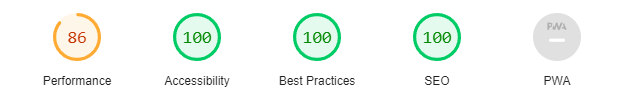

### Exercises Page
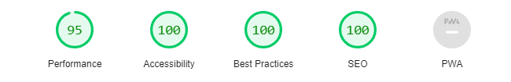

### Sign Up Page
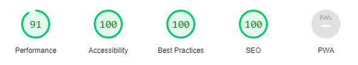

### Bugs

- The first bug that I found was the hero image on the About us page not showing on my deployed page. As I deployed my page early, I found this straight away. The problem was due to a file directory. I simply removed the first '/' from its file path and that fixed the problem.
- Another bug that I experienced was an Iframe being in an incorrect position on my exercises page, this iframe was inheriting a margin-top property, I removed this and thus fixed the problem.

## Deployment

- The site was deployed to GitHub pages. The steps to deploy are as follows:
  - In the GitHub repository, navigate to the Settings tab
  - From the source section drop-down menu, select the Master Branch
  - Once the master branch has been selected, the page will be automatically refreshed with a detailed ribbon display to indicate the successful deployment.
  - Due to me deploying the site early, it helped me spot any potential bugs early on the deployed site. This helped me to negate any problems that would have not shown on the live server.

The live link can be found here - <https://codybradbury05.github.io/PortfolioProject1/>

## Credits

### Content

- The icons in the footer were taken from. [Font Awesome](https://fontawesome.com/)
- The code for the footer, nav bar and sign-up page were taken and adapted from the CI Love Running project. Furthermore, code to make my design responsive was also mostly used from here. [Love Running Project](https://github.com/Code-Institute-Solutions/love-running-v3/tree/main)

### Media

- The photos used on the home and sign up page are from[Pexels](https://www.pexels.com/)
- The videos used on the exercises page were taken from youtuber Jeremy Ethier [Jeremy Ethier](https://www.youtube.com/@JeremyEthier)

