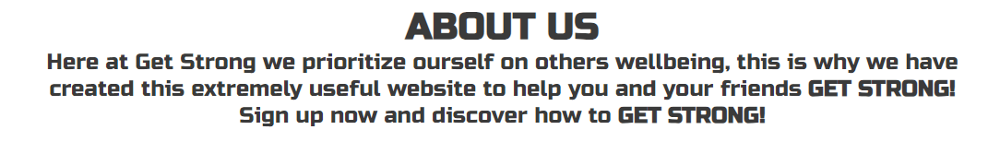

# Get Strong

Get Strong is a landing page to encourage people to get strong within the gym. Get strong provides a set of example exercises in order to help with strength gains. Get strong helps people of all skill levels and gives them basic knowledge.

## Features

In this section, you should go over the different parts of your project, and describe each in a sentence or so. You will need to explain what value each of the features provides for the user, focusing on who this website is for, what it is that they want to achieve and how your project is the best way to help them achieve these things.

### Existing Features

- __Navigation Bar__

  - The Navigation Bar is on all 3 pages. This allows users to easily navigate around the pages. The Nav Bar consists of the Home page, Exercises page and the Sign up page.
  - The Home page engages the user and acknowledges the user of what the page is about and why they are here. Straight away the users are aware of the purpose of the site and whether or not it is the correct site for them.
  - The Nav bar aids to accessibility within the website without having to use built in browser features to navigate the site. For example the 'back' or 'forwards' button. The 'Get Strong' heading allows the user to click and head straight back to the home page.
  

- __The landing page image__

  - The Get Strong landing page image instantly grabs the attention of the user and notifies them of the purpose of the site.
  - The landing page, has a big hero image and smaller text area which consists of the website name and 'Join Now!'

- __Get Strong About Section__

  - The Get strong about section, lets the user know the purpose of the website.
  - This will entice the user to navigate the page and eventually sign up to Get Strong!

- __Location Section__

  - This section allows the user to see where Get Strong is based and where they can come and help themselves get strong.
  - Get Strong is based out of one of the best gyms in the UK!

- __The Footer__

  - The footer section includes links to the relevant social media sites for Love Running. The links will open to a new tab to allow easy navigation for the user.
  - The footer is valuable to the user as it encourages them to keep connected via social media
  - The footer section includes the 'links' for the Get Strong social media pages. The links open in a new tab to make sure their time on the website is not interupted.
  - The footer adds value to the user as they can keep up to date with Get Strong through social media.

- __Exercises__

  - The gallery will provide the user with supporting images to see what the meet ups look like.
  - This section is valuable to the user as they will be able to easily identify the types of events the organisation puts together.
  - The exercises section provides the ueer with example videos of exercises to see ways of getting strong.
  - This provides value to user as they will able to view any potential exercises they may want to try themselves to help get strong.

- __The Sign Up Page__
- 
  - This page allows the user to get signed up to Get Strong and start their path to getting stronger. The user will be asked and required to enter their full name and email address in order to signup.

For some/all of your features, you may choose to reference the specific project files that implement them.

In addition, you may also use this section to discuss plans for additional features to be implemented in the future:

### Features Left to Implement

- In the future, this website has the ability to become a fully implemented gym website that can help meet targets and allow gym members to track their lifts. The potential is limitless.

## Testing

In this section, you need to convince the assessor that you have conducted enough testing to legitimately believe that the site works well. Essentially, in this part you will want to go over all of your project’s features and ensure that they all work as intended, with the project providing an easy and straightforward way for the users to achieve their goals.

In addition, you should mention in this section how your project looks and works on different browsers and screen sizes.

You should also mention in this section any interesting bugs or problems you discovered during your testing, even if you haven't addressed them yet.

If this section grows too long, you may want to split it off into a separate file and link to it from here.

### Crossbrowser Testing

- I have checked my website works on multiple browsers, such as Firefox, Edge, Opera, Chrome.

### Responsive Design Testing

- My responsive design works as intended on all these browsers I have tested.
- I have used websites such as <https://ui.dev/amiresponsive?url=https://codybradbury05.github.io/PortfolioProject1/> to also check whether my responsive design works and looks good.
- I have used the chrome devtools to check my responsive design works, testing on all different screen sizes. For example, Galaxy Fold, Ipad Mini, Google Nest Hub Max.

### Readability

- I have clarified through myself and others that my design is readable and easy to understand as well as my design being consistent via colours, fonts and images.

### Usablity 

- I have tested that everything the user can interact with works as intended. As follows, all links within the nav bar work correctly, the iframe within the about page is interactive, the footer links work and open within a new page, the videos on the exercises page start at 0:00 are playable and the sound works correctly as well as when opened in youtube open a new tab. Furthermore, the signup page works properlly, all inputs are required, the email section requires an email and the button submits the form and verifies so form by opening the CI form dump page with inputted values present.

### Validator Testing

  - No errors were returned when passing through the official [W3C validator](https://validator.w3.org)
  - No errors were found when passing through the official [(Jigsaw) validator](https://jigsaw.w3.org/css-validator/validator#css)

### Bugs

- My first bug that I found was the hero image on the about us page not showing on my deployed page. As I deployed my page early, I found this straight away. The problem was due to a file directory. I simply removed the first '/' from its file path and that fixed the problem.
- Another bug that I experienced was an Iframe being in an incorrect position on my exercises page, this iframe was inheritting a margin-top property, I removed this and thus fixed the problem.

## Deployment

- The site was deployed to GitHub pages. The steps to deploy are as follows:
  - In the GitHub repository, navigate to the Settings tab
  - From the source section drop-down menu, select the Master Branch
  - Once the master branch has been selected, the page will be automatically refreshed with a detailed ribbon display to indicate the successful deployment.
- Due to me deploying the site early it helped me spot any potential bugs early on the deployed site. This helped me to negate any problems that would have not showed on the live server.

The live link can be found here - <https://codybradbury05.github.io/PortfolioProject1/>

## Credits

In this section you need to reference where you got your content, media and extra help from. It is common practice to use code from other repositories and tutorials, however, it is important to be very specific about these sources to avoid plagiarism.

You can break the credits section up into Content and Media, depending on what you have included in your project.

### Content

- The icons in the footer were taken from [Font Awesome](https://fontawesome.com/)
- The code for the footer, nav bar and signup page were taken and adapted from the CI Love Running project. [Love Running Project](https://github.com/Code-Institute-Solutions/love-running-v3/tree/main)

### Media

- The photos used on the home and sign up page are from[Pexels](https://www.pexels.com/)
- The videos used on the exercises page were taken from youtuber Jeremy Ethier [Jeremy Ethier](https://www.youtube.com/@JeremyEthier)

